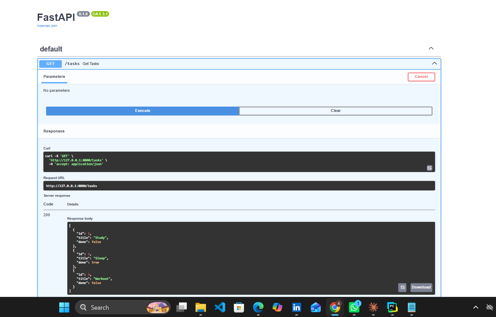

# Task API

A simple REST API built with **FastAPI** that performs CRUD (Create, Read, Update, and Delete) operations on an in-memory list of tasks. The API also provides interactive documentation using **Swagger UI**.

---

## Features

- Create a new task
- Retrieve all tasks
- Retrieve a task by ID
- Update a task
- Delete a task
- Interactive Swagger UI documentation

---

## Installation

### 1. Clone the repository

```bash
git clone https://github.com/aiza465/flyrank.git
```

### 2. Navigate to the project directory

```bash
cd flyrank
```

### 3. Install the dependencies

```bash
pip install -r requirements.txt
```

### 4. Run the application

If your main file is `WEEK2.py`:

```bash
uvicorn WEEK2:app --reload
```

If your main file is `main.py`:

```bash
uvicorn main:app --reload
```

The API will start at:

```
http://127.0.0.1:8000
```

Swagger UI:

```
http://127.0.0.1:8000/docs
```

---

## API Endpoints

| Method | Endpoint | Description |
|--------|----------|-------------|
| GET | `/tasks` | Retrieve all tasks |
| GET | `/tasks/{id}` | Retrieve a task by its ID |
| POST | `/tasks` | Create a new task |
| PUT | `/tasks/{id}` | Update an existing task |
| DELETE | `/tasks/{id}` | Delete a task |

---

## Example cURL

```bash
curl.exe -i http://127.0.0.1:8000/tasks
```

### Example Output

```http
HTTP/1.1 200 OK
date: Wed, 22 Jul 2026 16:32:24 GMT
server: uvicorn
content-length: 120
content-type: application/json

[
  {
    "id": 1,
    "title": "buy crop",
    "done": false
  },
  {
    "id": 2,
    "title": "Sleep",
    "done": true
  },
  {
    "id": 4,
    "title": "buy milk",
    "done": false
  }
]
```

---

## Swagger UI

Below is the automatically generated Swagger documentation provided by FastAPI.


```markdown

```

---

## Technologies Used

- Python
- FastAPI
- Pydantic
- Uvicorn

---

## Project Structure

```
flyrank/
│── WEEK2.py
│── README.md
│── requirements.txt
│── .gitignore
│── img.png
```

---

## Author

**Aiza**